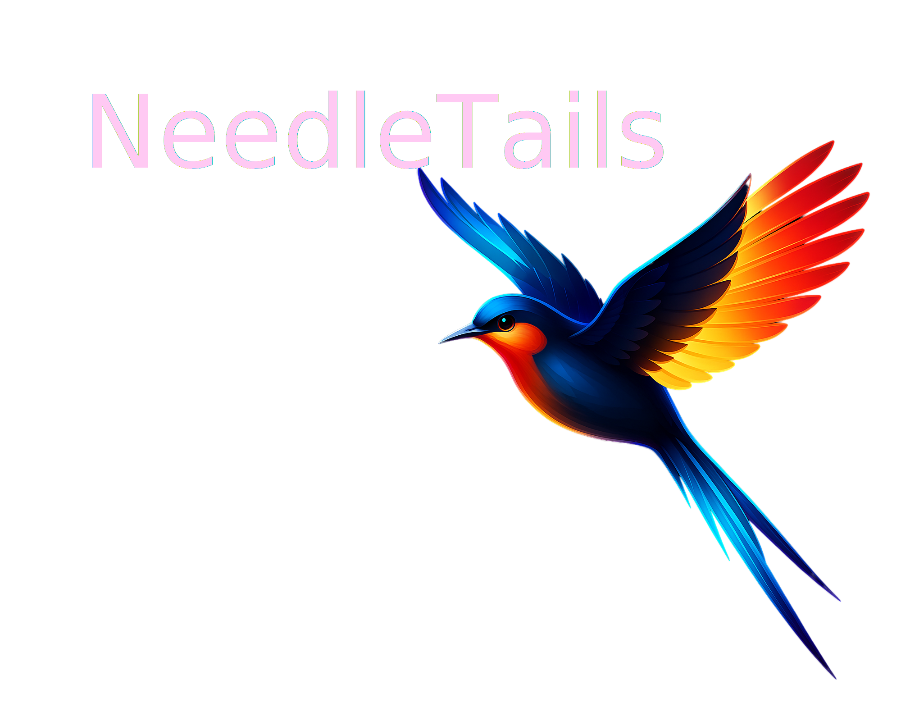

# NeedleTails Support Website

Welcome to the NeedleTails Support Website! This platform serves as an interface between open-source and closed-source software, connecting individuals and organizations with the resources and expertise they need.

## About NeedleTails

NeedleTails is dedicated to fostering collaboration and support within the software development community. Our mission is to bridge the gap between different software sources and provide a space for developers, enthusiasts, and businesses to find the help they need.

## What We Offer

- **Expert Connections**: Find experienced Swift programmers who can assist with your projects, whether they are open-source or closed-source.
- **Resource Hub**: Access a variety of resources, including documentation, tutorials, and guides related to both open and closed-source software.
- **Community Support**: Join a community of like-minded individuals who are passionate about software development and collaboration.

## Features

- **Search Functionality**: Easily search for experts in Swift programming or specific software projects.
- **User Profiles**: Browse profiles of Swift experts, showcasing their skills, experience, and areas of expertise.
- **Discussion Forums**: Engage in discussions with other users to share knowledge, ask questions, and collaborate on projects.
- 🌐 **Multi-language Support** - 13 languages including English, Spanish, French, German, Chinese, Japanese, and more
- 📱 **Responsive Design** - Optimized for desktop, tablet, and mobile devices
- ⚡ **Performance Optimized** - Fast loading with modern web technologies
- 🎨 **Modern UI** - Clean, professional design with smooth animations
- 🚀 **Automated Deployment** - GitHub Actions for seamless deployment

## Tech Stack

- **Framework**: Nuxt.js 4
- **Language**: TypeScript
- **Styling**: Tailwind CSS
- **State Management**: Pinia
- **Internationalization**: @nuxtjs/i18n
- **Deployment**: GitHub Pages + GitHub Actions

## Getting Started

To get started, simply navigate through our website to explore the available resources and connect with experts. Whether you are looking to contribute to an open-source project or need assistance with a closed-source application, NeedleTails is here to help!

### Development Setup

Make sure to install dependencies:

```bash
# npm
npm install

# pnpm
pnpm install

# yarn
yarn install

# bun
bun install
```

### Development Server

Start the development server on `http://localhost:3000`:

```bash
# npm
npm run dev

# pnpm
pnpm dev

# yarn
yarn dev

# bun
bun run dev
```

### Production Build

Build the application for production:

```bash
# npm
npm run build

# pnpm
pnpm build

# yarn
yarn build

# bun
bun run build
```

Locally preview production build:

```bash
# npm
npm run preview

# pnpm
pnpm preview

# yarn
yarn preview

# bun
bun run preview
```

## Deployment

This project is configured for automatic deployment to GitHub Pages. See [DEPLOYMENT.md](./DEPLOYMENT.md) for detailed setup instructions.

### Quick Deploy

For manual deployment:
```bash
npm run deploy
```

### GitHub Actions

The project includes automated workflows:
- **Test**: Runs on pull requests to ensure build success
- **Deploy**: Automatically deploys to GitHub Pages on main branch pushes

## Contributing

We welcome contributions from the community! If you are interested in helping us improve the platform, please check out our [Contributing Guidelines](CONTRIBUTING.md).

1. Fork the repository
2. Create a feature branch (`git checkout -b feature/amazing-feature`)
3. Commit your changes (`git commit -m 'Add some amazing feature'`)
4. Push to the branch (`git push origin feature/amazing-feature`)
5. Open a Pull Request

## Issue Templates

We provide several issue templates to help with bug reports and feature requests:
- 🐛 **Bug Report** - For reporting bugs and issues
- ✨ **Feature Request** - For suggesting new features
- 🌐 **Website Issue** - For website-specific problems

## License

This project is licensed under the terms of the [MIT License](LICENSE.md).

## Contact Us

If you have any questions or need further assistance, feel free to reach out to us at [support@needletails.com](mailto:support@needletails.com).

For support and questions:
- 📧 Email: support@needletails.com
- 🐛 Issues: [GitHub Issues](https://github.com/needletails/needletails-website/issues)
- 📖 Documentation: [DEPLOYMENT.md](./DEPLOYMENT.md)

Thank you for visiting the NeedleTails Support Website! Together, we can enhance collaboration and support in the software development community.

---

*This README was last updated on 12/27/24.*

Built with ❤️ by [NeedleTails](https://needletails.com)
